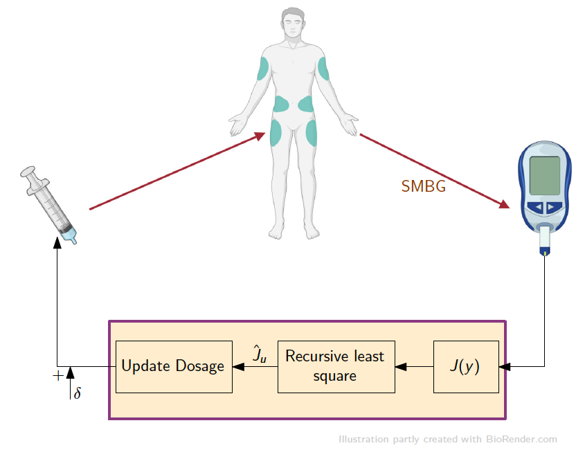

# Model-free dose guidance algorithm for Type 2 Diabetes

This repository consists of the source code published in:
* **Krishnamoorthy, D.**, Dimitri Boiroux, Tinna Björk Aradottir, Sarah Ellinor Engell and John Bagterp Jørgensen, 2021. A Model-free Approach to Automatic Dose Guidancein Long Acting Insulin Treatment of Type 2 Diabetes. _IEEE Control System Letters_ (In-Press)**

This paper presents a model-free insulin titration algorithm for patients with type 2 diabetes that automatically finds and maintains the optimal insulin dosage in order to maintain the blood glucose concentration at desired levels. The proposed method is based on recursive least square based extremum seeking control.

This is a joint work with the Technical University of Denmark (DTU Compute) and Novo Nordisk. 

**See a slightly extended version of the paper here since the journal has a strict 6 page limit, where we add a few lines about the practical implementation of the algorithm.

